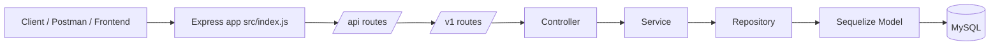

# Base Project 1

Node.js and Express starter project with Sequelize, MySQL, structured layers, and a small REST API for airplanes.

## What this project does

This project is built as a layered REST API. The application receives HTTP requests in Express, passes them through routes and controllers, applies business logic in services, and writes to MySQL through Sequelize models and repositories.

The current API surface includes:

- `GET /api/v1/info` to verify the API is alive
- `POST /api/v1/airplanes` to create an airplane record

## Production Flow

The request path in this project is:



### How the flow works

1. `src/index.js` creates the Express app, enables JSON parsing, mounts the API router, and starts the server.
2. `src/routes/index.js` mounts versioned routes under `/api/v1`.
3. `src/routes/v1/index.js` wires feature routes such as airplanes and the info endpoint.
4. Controllers validate and shape the request/response.
5. Services contain business logic and coordinate repository calls.
6. Repositories wrap model access and keep database logic isolated.
7. Sequelize models define the schema and map to MySQL tables.

## Folder Structure

```text
src/
  index.js                # App entrypoint
  config/                 # Server, logger, and Sequelize configuration
  controllers/            # Request handlers
  routes/                 # Route registration and versioning
  services/               # Business logic layer
  repositories/           # Database access layer
  models/                 # Sequelize models
  migrations/             # Sequelize migrations
  seeders/                # Sequelize seeders
  utils/                  # Shared helpers
```

## Important Files

- [src/index.js](src/index.js) starts the server and mounts `/api`.
- [src/routes/index.js](src/routes/index.js) mounts versioned routes.
- [src/routes/v1/index.js](src/routes/v1/index.js) connects airplane routes and the info endpoint.
- [src/controllers/airplane-controller.js](src/controllers/airplane-controller.js) handles airplane creation requests.
- [src/services/airplane-service.js](src/services/airplane-service.js) contains the airplane business logic.
- [src/repositories/airplane-repository.js](src/repositories/airplane-repository.js) wraps the Sequelize model.
- [src/models/airplane.js](src/models/airplane.js) defines the airplane schema.
- [src/config/sequelize-config.js](src/config/sequelize-config.js) loads MySQL settings from environment variables.

## Configuration

Create a `.env` file in the project root:

```env
PORT=3000
DB_USER=root
DB_PASSWORD=your_mysql_password
DB_NAME=flights_development
DB_HOST=127.0.0.1
```

The app uses `dotenv` to read these values on startup.

### Database config behavior

- `DB_USER` sets the MySQL user
- `DB_PASSWORD` sets the MySQL password
- `DB_NAME` sets the development database name
- `DB_HOST` sets the MySQL host

If `DB_PASSWORD` is missing, Sequelize will try to connect without a password and MySQL will reject it.

## Setup

1. Install dependencies:

```bash
npm install
```

2. Create the database:

```bash
npx sequelize db:create
```

3. Run migrations if needed:

```bash
npx sequelize db:migrate
```

4. Start the server:

```bash
npm start
```

## Sequelize CLI Commands

The repo includes a `.sequelizerc` file so Sequelize CLI uses the `src` folders instead of the default root folders.

Useful commands:

```bash
npx sequelize db:create
npx sequelize db:migrate
npx sequelize db:seed:all
npx sequelize model:generate --name Airplane --attributes modelNumber:string,capacity:integer
```

## API Endpoints

### Health check

`GET /api/v1/info`

Response example:

```json
{
  "success": true,
  "name": "Base Project",
  "description": "This is a base project for building RESTful APIs using Node.js and Express.",
  "msg": "api is alive",
  "error": {},
  "data": {}
}
```

### Create an airplane

`POST /api/v1/airplanes`

Request body:

```json
{
  "modelNumber": "airbus-320",
  "capacity": 200
}
```

Expected result:

- Controller receives the request
- Service forwards the data
- Repository writes to the `Airplane` model
- Sequelize stores the row in MySQL

## How airplane creation works

1. The client sends a `POST` request to `/api/v1/airplanes`.
2. `AirplaneController.createAirplane` reads the body.
3. `AirplaneService.createAirplane` receives the payload.
4. `AirplaneRepository.create` calls Sequelize `model.create()`.
5. Sequelize inserts the row into MySQL.
6. The controller returns the created record as JSON.

## Troubleshooting

### `Access denied for user 'root'@'localhost' (using password: NO)`

This means the app started without a `DB_PASSWORD` value.

Fix:

```env
DB_PASSWORD=your_mysql_password
```

### `mysql` command not found

Use the full path to `mysql.exe` or add MySQL `bin` to PATH.

### `No database selected`

Run:

```sql
USE flights_development;
```

## Notes

- Logs are written through Winston.
- The project uses MySQL through Sequelize.
- The codebase is already organized for future CRUD expansion.